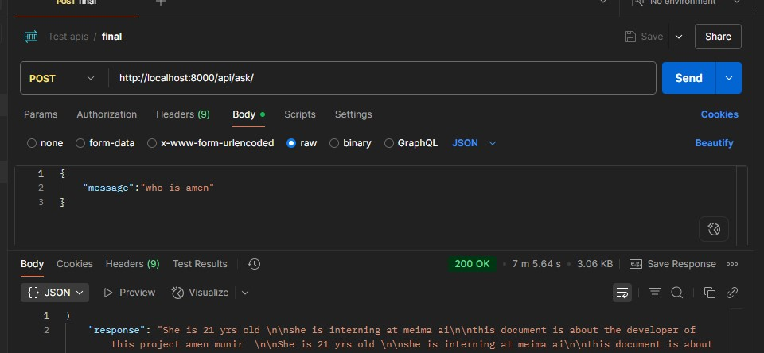

# ChatBot using LangChain ChatGPT

## Features

- Upload PDF files and store them securely
- Split and embed document chunks using LangChain
- Store embeddings in a vector database (FAISS)
- Ask questions about the uploaded file
- Retrieve the most relevant chunks and generate responses using ChatGPT
- Frontend chat interface in React

## Backend 

### 1. Django Configuration
- Setup Django app and project structure
- Added models for:
  - Document uploads
  - Document chunks (text + embeddings)
- Ran migrations to update schema

### 2. API Functionality
- File upload API (`POST`)
- Get uploaded files API (`GET`)
- User query API for document Q&A (`POST`)
- Handled form-data (for PDFs) and JSON (for user input)

### 3. ChatGPT + LangChain Integration
- Set up OpenAI API key and GPT-based response generation
- Used HuggingFace model to generate embeddings (fallback due to OpenAI quota issues)
- Chunked documents using `RecursiveCharacterTextSplitter`
- Stored and indexed embeddings in FAISS vector store

##  Final

- Fine-tuning **PromptTemplate** for better query responses
- Testing vector search on  documents
- Switching to local LLM via **LM Studio** for offline use

##  Testing with Postman

- Uploaded PDFs with `form-data`
- Checked DB for chunk creation
- Sent dummy queries and confirmed GPT response
- Slow response on frontend due to local LLM performance 

##  Frontend  (React)

### 1. Setup
- Initialized React app
- Configured services for:
  - File upload
  - User query
  - Status and error handling

### 2. UI
- Clean and Simple UI for:
  - Upload interface
  - Chat interface for asking questions
- Simple loading and success feedback

## Prompt + Response Logic

- Retrieve similar chunks using `FAISS.similarity_search()`
- Construct prompt using retrieved data
- Pass context and query to ChatGPT
- Return final answer as chatbot response

##  Known Issues

-  Local model takes time to load and affects testing
- Prompt generation can be better

## final

- Integrate local LLM (ChatGPT 3 via LM Studio)
- Improve response quality using custom prompt templates
- Final testing and UI polishing
- Optional: Add user authentication and chat history

## Screenshots 

